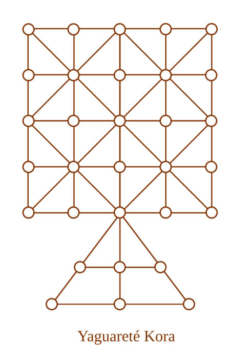
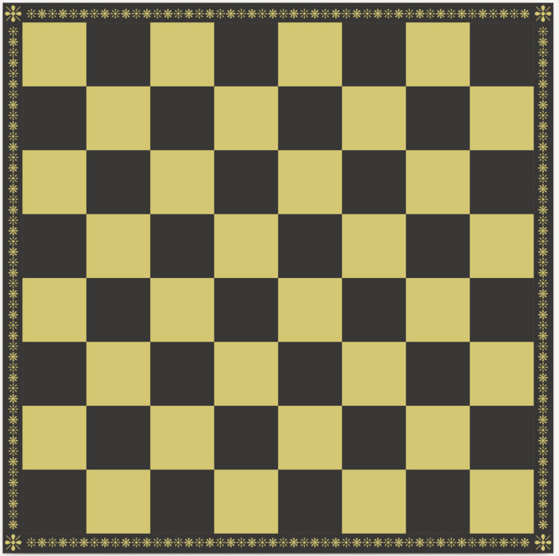
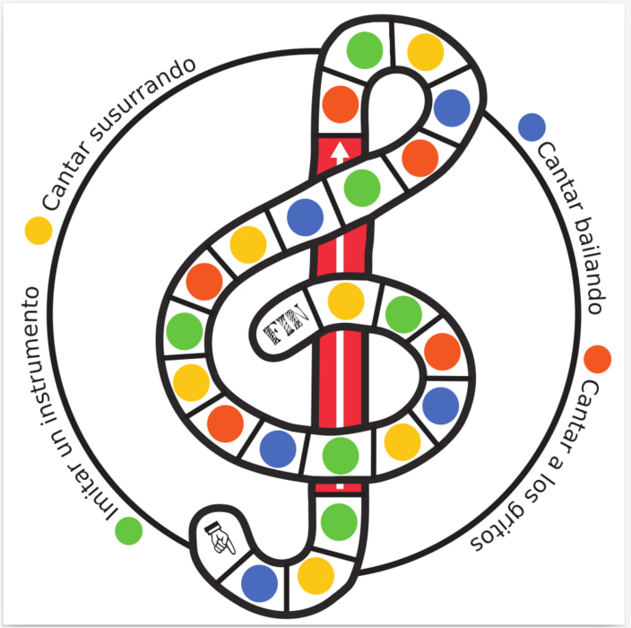
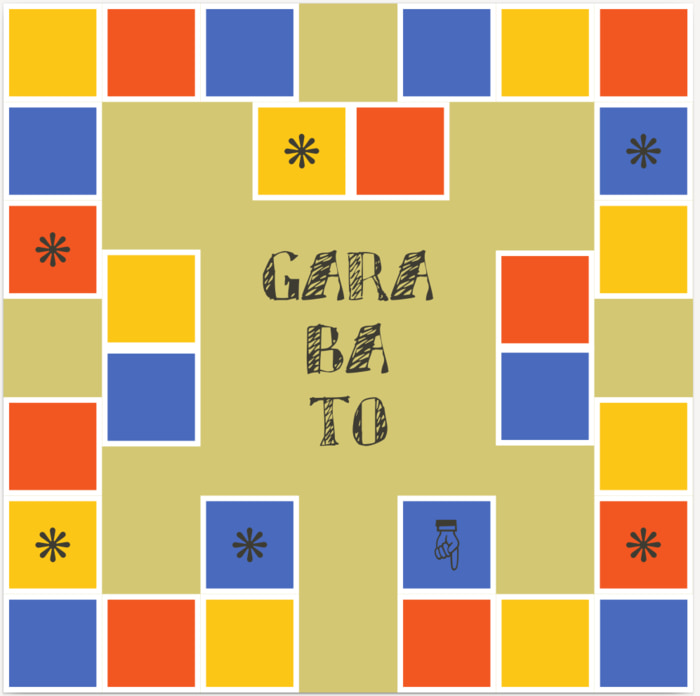
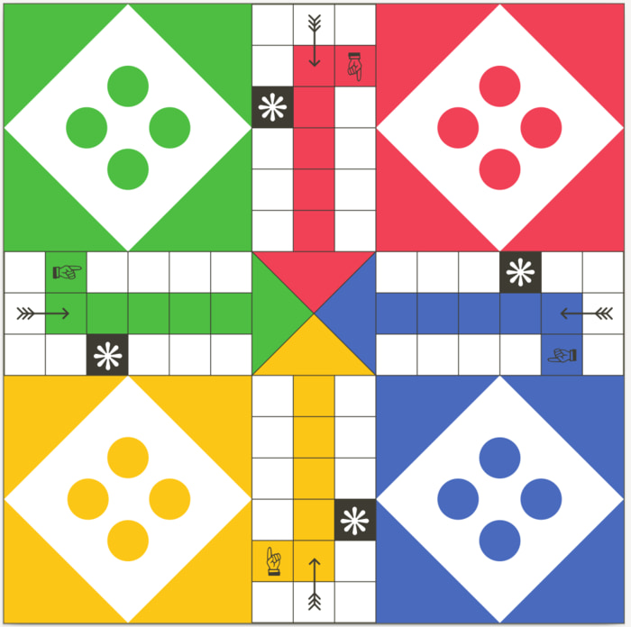
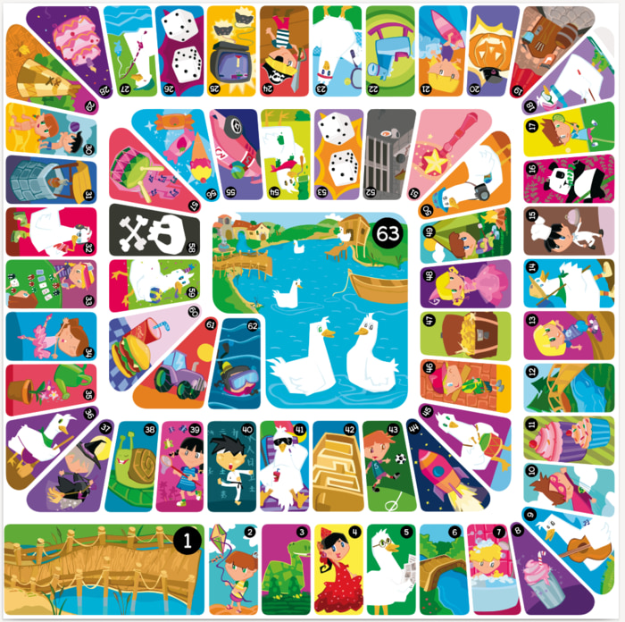

# Juegos de Mesa

Tableros, cartas y reglas de juegos de mesa en PDF (impresión) y SVG (edición).

## Juegos incluidos:

### Yaguareté kora - Chivi kora

El Yaguareté Kora o Chivi Kora (el corral del yaguarté) es un juego
tradicional de tablero que practican niños y niñas en las
comunidades mbya guaraní. Consiste en acorralar a un yaguareté
y evitar ser atrapado. Un juego de estrategia que ha sido
transmitido de generación a generación de manera oral
y que continúa jugándose en las comunidades
indígenas de Misiones.

### Ajedrez

Un tablero de ajedrez.

### Clave de Sol

Un juego de prendas musical. Fuente: [Fichero de juegos : el juego : derecho y motor del desarrollo infantil](https://www.unicef.org/argentina/media/3306/file/Fichero%20de%20juegos.pdf)

### Garabato

Un juego inspirado en Pictionary para niños y niñas.

### Ludo

Tablero y reglas del Ludo.

### Oca

El tablero y reglas del juego de la Oca.

---

Se incluye la tipografía para las tarjetas de de Garabato.
